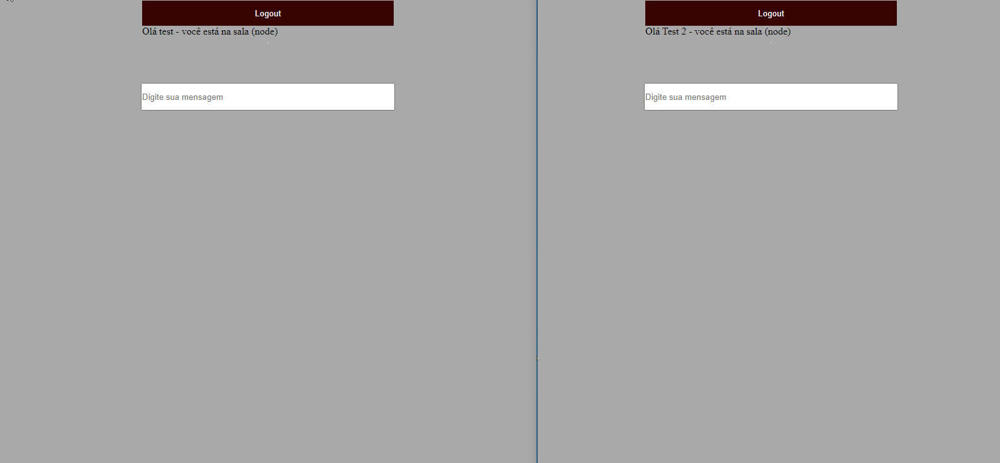

<h1 align="center">
<br>

<p align="center">
    <b ></b>Chat em tempo real</b>
</p>

<div align="center" >
    
    </div>

<p align="center">
  <a href="#bookmark-about">About</a>&nbsp;&nbsp;&nbsp;|&nbsp;&nbsp;&nbsp;
  <a href="#computer-technologies">Techs</a>&nbsp;&nbsp;&nbsp;|&nbsp;&nbsp;&nbsp;
  <a href="#package-installation">Installation</a>&nbsp;&nbsp;&nbsp;
</p>

## :bookmark: About

<p align="center">
    <b ></b>Um chat em tempo real salvando as mensagens no redis</b>
</p>

<br>

## 🛠 Techs
  - [Typescript](https://www.typescriptlang.org/)
  - [Redis](https://redis.io/)
  - [Socket](https://socket.io/)

<br>

## :package: Installation

### Rodando o chat  🚀

#### Cloning

```ps
# Clone o repositório utilizando o git
$ git clone
```

### :arrow_forward: **Exutando**

```sh
  $ npm install
  $ npm run start:dev
```
